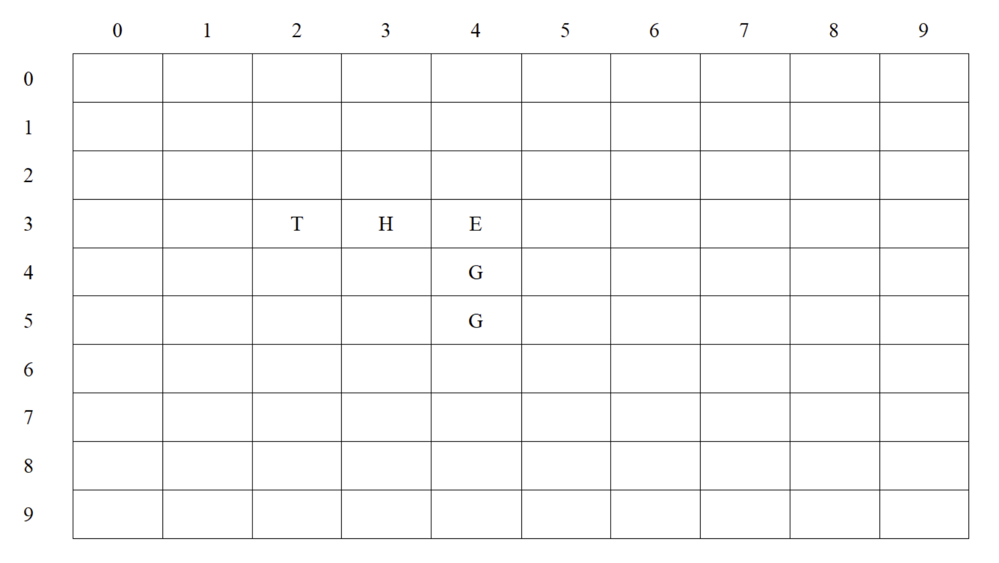

# Lab 5 Array
## Topic 2.5 Arrays

### Intended Learning Outcomes:

Upon completion of this tutorial/lab, you should be able to:

- Determine the name, size, data type and initial values of an array for a defined problem.
- Declare one- and two-dimensional arrays.
- Use `.length` to get the size of an array.

## Exercise 1

What will be printed on the screen when the program fragment below is executed?

```java
int [] a = {1, 2, 3, 4, 5};
System.out.println( a[1] + a[4] );
```
```
# Output:
7
```

## Exercise 2
Identify whether the array declarations below are valid.
| Code | valid | invalid |
| ---- | ----- | ------- |
| char [] charArray = new charArray[26]; | [] | [x] |
| char charArray[] = new charArray[26]; | [] | [x] |
| int [] words = new words[100]; | [] | [x] |
| int [100] words = new int []; | [] | [x] |
| char [] name = "Peter"; | [] | [x] |
| char [] name = {'P', 'e', 't', 'e', 'r'}; | [x] | [] |
| char [] name = {"P", "e", "t", "e", "r"}; | [] | [x] |
| double [] nums = [10.5, 25.1, 30.05]; | [] | [x] |
| double [] nums = {-3.5, 0, 3, 20.5}; | [x] | [] |


## Exercise 3
Write a program statement to declare an array named scores with initialize values: 5, 66, 2, 19, 6, 0.
```
double[] scores = {5, 66, 2, 19, 6, 0};
// or
int[] scores = {5, 66, 2, 19, 6, 0};
```

## Exercise 4
Identify whether the 2D array declarations below are valid.

| Code | valid | invalid |
| - | - | - |
| `int [3][4] matrix;` | [] | [x] |
| `double [3][4] matrix = new double[][];` | [] | [x] |
| `int [][] matrix = new int[3][4];` | [x] | [] |
| `int [][] matrix = new double[3][4];` | [] | [x] |
| `double [][] matrix = new double[][4];` | [] | [x] |
| `int [][] matrix = {(1, 2), (3, 4), (5, 6)};` | [] | [x] |
| i`nt [][] matrix = {1, 2}, {3, 4}, {5, 6};` | [] | [x] |
| `int [][] matrix = {{1, 2}, {3, 4}, {5, 6}};` | [x] | [] |

## Exercise 5
Given the 2D array declaration:
```java
int [][] m = {{1, 2, 3}, {4, 5, 6}, {7, 8, 9}, {10, 11, 12}};
```
What will be printed on the screen when the program fragments below are executed?
| Code | Output |
| ---- | ------ |
| System.out.print( m[0][0] ); | 1 |
| System.out.print( m[1][2] ); | 6 |
| System.out.print( m[3][1] ); | 11 |
| System.out.print( m[0][2] + m[3][1] ); | 14 |
| System.out.print( m.length ); | 4 |
| System.out.print( m[2].length ); | 3 |
| System.out.print( m[2][m[0][1]] ); | 9 |
| System.out.print( m[m[1].length][1]*2 ); | 22 |

## Exercise 6
Given the 2D array declaration:
```java
char [][] board = new char[10][10];
``` 
Complete the assignment statements below for storing THE and EGG into the 2D array so that it looks like:

```java
board [a][b] = 'T';
board [c][d] = 'H';
board [e][f] = 'E';
board [g][h] = 'G';
board [i][j] = 'G';
```

a) 3
b) 2
c) 3
d) 3
e) 3
f) 4
g) 4
h) 4
i) 5
j) 4

## Exercise 7
Write a program to declare an array with the following settings:
- Array variable: `list`
- Data type: `int`
- Size: `10 elements`
- Values: `default to 0`

And then prints the data values stored in the array list by using following for loop.
```java
for ( int i=____; i < _____________; i++)
    System.out.println( ______________ );
```

```java
// Answer
for (int i = 0; i < list.length; i ++>)
    System.out.println( list[i] );
```

## Exercise 8
Generate a Multiplication Table:

Write a Java program to fill values to a two-dimensional array, mTable[10][10], for a multiplication table. Print the multiplication table as follows.
```
C:\> java Ex8
      0  1  2  3  4  5  6  7  8  9
   +------------------------------
  0|  0  0  0  0  0  0  0  0  0  0
  1|  0  1  2  3  4  5  6  7  8  9
  2|  0  2  4  6  8 10 12 14 16 18
  3|  0  3  6  9 12 15 18 21 24 27
  4|  0  4  8 12 16 20 24 28 32 36
  5|  0  5 10 15 20 25 30 35 40 45
  6|  0  6 12 18 24 30 36 42 48 54
  7|  0  7 14 21 28 35 42 49 56 63
  8|  0  8 16 24 32 40 48 56 64 72
  9|  0  9 18 27 36 45 54 63 72 81
```

## Exercise 9
Write a Java program to prompt a user to input some positive real numbers and store them in an array. The user can enter no more than 10 numbers. The program should stop prompting input when the user has entered the 10th number or input a negative value, e.g. -1. Then, the program starts to calculate the following statistics.
1. Maximum
2. Minimum

Test your program with the following five numbers, 1.23, 2.05, 4.0, 0.01, 0.12. Their maximum=4.0 and minimum=0.01.

```
C:\> java Ex9
Enter number 1 : 1.23
Enter number 2 : 2.05
Enter number 3 : 4.0
Enter number 4 : 0.01
Enter number 5 : 0.12
Enter number 6 : -1
Maximum = 4.0
Minimum = 0.01
```