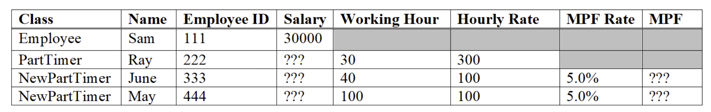

# Lab 12 Object Array and Inheritance
## Exercise 1
A sales invoice contains an invoice number and a list of items. Each item has a product code, a price, and the quantity purchased. Sales invoice and purchase items are implemented by the Java classes `Invoice` and `Item`, whose skeletons are given below. In the `Invoice` class, `itemList` is an array of `Item` objects. When an `Invoice` object is instantiated, the number of items in the invoice (and thus the number of elements in itemList) is specified via the constructor parameter `itemNum`. The method `addItem()` creates an `Item` object instance and “saves” it in the array `itemList`

```java
public class Invoice {
    private String invNumber;
    private Item[] itemList;
    private int itemCount;

    public Invoice(String invNumber, int itemNum) {

        // 1. Set instance variable invNumber

        // 2. Create an array of Item with number of elements specified

        // by parameter itemNum. Refer to Topic 4.6, Slide 9

        // 3. Set itemCount to 0, as there is no Item initially.

        …

    }

    public String getInvNumber() {
        return invNumber;
    }

    public Item[] getItemList() {
        return itemList;
    }

    public int getItemCount() {
        return itemCount;
    }

    public Item getItem(int index) {
        return itemList[index];
    }

    public void addItem(String productCode, double price, int quantity) {

        if (itemCount < itemList.length) {
            // create a new Item; Refer to Topic 4.6, Slide 9
            // save item to appropriate element in itemList

            …

            itemCount++;
        } else {
            System.out.println("Failed to add new item; max already");
        }
    }
}
```

```java
public class Item {
    private String productCode;
    private double price;
    private int quantity;

    public Item(String productCode, double price, int quantity) {
        …
    }

    public double getItemTotal() {
        …
    }

    public String toString() {
        …
    }

}
```
Complete the Java classes `Invoice` and `Item`. To assist your understanding, the program `Purchase` below and its execution output are given.

```java
public class Ex1 {

    public static void main(String[] args) {
        Invoice inv = new Invoice("A123", 4);
        double total = 0;
        inv.addItem("U-231", 34.5, 10);
        inv.addItem("J-994", 124.5, 5);
        inv.addItem("K-674", 4.5, 100);

        for (int i = 0; i < inv.getItemCount(); i++) {
            System.out.println(inv.getItem(i));
            total += inv.__________(i).____________();
        }

        System.out.println("Invoice Total = " + total);
    }
}
```

```
C:\> java Ex1
U-231:34.5*10=345.0
J-994:124.5*5=622.5
K-674:4.5*100=450.0
Invoice Total = 1417.5
```

## Exercise 2 
Given the `Employee` class below.

```java
public class Employee {
    public static final int MIN_ID = 1000;
    protected String name;
    protected int employeeID;

    public Employee(String n, int id) {
        name = n;
        if (id < MIN_ID)
            employeeID = 0;
        else
            employeeID = id;

    }

    public String toString() {
        return "Name: " + name + ", ID: " + employeeID;
    }
}
```

Write a class `FTEmployee` that inherits from `Employee` and has the following additional member variables and methods:

<table>
<tr>
    <td>Variable:</td>
    <td><code>double salart</code></td>
</tr>
<tr>
    <td>Methods:</td>
    <td>
        <ul>
            <li>
                <code>public FTEmployee(String name, int employeeID, double salary)</code>
                The constructor of <code>FTEmployee</code> MUST make use of the <code>Employee</code> constructor to initialize those member variables declared in <code>Employee</code> (i.e. <code>name</code> and <code>employeeID</code>).
            </li>
            <li>
                <code>toString()</code>
                The <code>toString()</code> of <code>FTEmployee</code> MUST make use of the <code>toString()</code> in the <code>Employee</code> class for handling those member variables declared in Employee</code> (i.e. <code>name</code> and <code>employeeID</code>).
            </li>
        </ul>
    </td>
</tr>
</table>

The testing program and the expected output are given below.

```java
public class Ex2 {
    public static void main(String[] args) {
        Employee emp = new Employee("John", 31520);
        FTEmployee ftemp = new FTEmployee("Mary", 42680, 15000.5);
        System.out.println(emp);
        System.out.println(ftemp);
    }

}
```

```
C:\> java Ex2
Name: John, ID: 31520
Name: Mary, ID: 42680, Salary: 15000.5
```

## Exercise 3

Given the `Student` class below.
```java
public class Student {

    protected String name;
    protected int stid; // student id
    protected int year;

    public Student(String name, int stid, int year) {
        this.name = name;
        this.stid = stid;
        setYear(year);
    }

    public void setYear(int year) {
        if (year > 0 && year <= 3)
            this.year = year;
        else {
            System.out.println("Wrong input! Year will be set to 1.");
            this.year = 1;
        }

    }

    public String toString() {
        return "Name: " + name + ", Student ID: " + stid + ", Year: " + year;
    }
}
```

Write a class `OutstandingStudent` that inherits from `Student`, and:
- Add a member variable award of type `String`.

- Provide a constructor to initialize the `name`, `stid`, `year`, and `award`.

- Override the `toString()` so that award is also be included in the return `String`.

The testing program and the expected output are given below.

```java
public class Ex3 {
    public static void main(String[] args) {
        Student s1 = new Student("Ben", 123, 2);
        System.out.println(s1);
        Student s2 = new Student("John", 246, 6);
        System.out.println(s2);
        Student os1 = new OutstandingStudent("Mary", 456, 3, "academic");
        System.out.println(os1);
        Student os2 = new OutstandingStudent("Peter", 567, 7, "sports");
        System.out.println(os2);
    }
}
```

```
C:\> java Ex3
Name: Ben, Student ID: 123, Year: 2
Wrong input! Year will be set to 1.
Name: John, Student ID: 246, Year: 1
Name: Mary, Student ID: 456, Year: 3, Award: academic
Wrong input! Year will be set to 1.
Name: Peter, Student ID: 567, Year: 1, Award: sports
```

## Exercise 4
Given the `Food` class below.

```java
public class Food {
    protected String name;
    protected int price;

    public Food() {
        name = null;
        price = 0;
    }

    public Food(String name, int price) {
        this.name = name;
        setPrice(price);
    }

    public String toString() {
        return "name=" + name + ", price=" + price;
    }

    public void setPrice(int price) {
        if (price >= 0)
            this.price = price;
        else
            this.price = 0;
    }
}
```

(a) Write a new class `Drink` that inherits from `Food`. The class `Drink` has the following additional variables and methods
- A protected instance variable volume of type int.
- A constructor that initializes `name`, `price`, and `volume`.
- A method `toString()` to return a string with name, price, and volume.
- The `setPrice()` method to set the instance variable price to 5 if the parameter `price` is less than 5. Otherwise call the super class’s `setPrice()` method. (NOTE: The minimum price of a drink is $5.)

The constructor and methods MUST make use of the constructors and methods of its superclass whenever possible.

The skeleton of the class is shown on the following.
```java
public class Drink extends Food {
    protected int volume;

    public Drink(String name, int price, int volume) {
        …
    }

    public void setPrice(int price) {
        …
    }

    public String toString() {
        …
    }
}
```

(b) Write a new class `Coffee` that inherits from `Drink`. The class `Coffee` has the following additional variables and methods:

- A protected instance variable `isSweet` of type `boolean`.
- A constructor that initializes `name`, `price`, `volume`, and `isSweet`.
- A method `toString()` to return a string with `name`, `price`, `volume`, and whether the coffee is sweet or not.
- The `setPrice()` method to set the instance variable price to 10 if the parameter price is less than 10. Otherwise call the super class’s `setPrice()` method. (NOTE: The minimum price of a cup of coffee is $10.)

The constructor and methods MUST make use of the constructors and methods of its superclass whenever possible.

The testing program and the expected output are shown below.

```java
public class Ex4 {
    public static void main(String[] args) {
        Food f = new Food("Rice", 3);
        Drink d = new Drink("Pepsi", 7, 250);
        Coffee c = new Coffee("Cappuccino", 13, 200, true);
        System.out.println(f);
        System.out.println(d);
        System.out.println(c);
    }
}
```

```
C:\> java Ex4
name=Rice, price=3
name=Pepsi, price=7, volume=250
name=Cappuccino, price=13, volume=200, sweet
```

## Exercise 5
Given the `Employee5` class below.

```java
public class Employee5 {
    String name;
    int employeeID;
    protected int salary;

    public Employee5(String name, int employeeID) {
        this.name = name;
        this.employeeID = employeeID;
    }

    public Employee5(String name, int employeeID, int salary) {
        this.name = name;
        this.employeeID = employeeID;
        this.salary = salary;
    }

    public String toString() {
        return "Name: " + name + ", Employee ID: "+employeeID + ", Salary: " + salary;
    }

}
```

(a) Write a new class `PartTimer` that inherits from `Employee5`. The class `PartTimer` has the following additional variables and methods:

- A protected instance variable `workingHour` of type `int`.
- A protected instance variable `hourlyRate` of type `int`.
- A protected method `calculateSalary()` to calculate and set the instance variable `salary`:

`salary = workingHour * hourlyRate`;

- A constructor that initializes `name`, `employeeID`, `workingHour`, and `hourlyRate`. The constructor then calls `calculateSalary()`. Note that a part-time employee’s working hour should not be greater than 220 hours per month. If the `workingHour` is greater than 220, it will be set to 0.
- Override the method `toString()` to return a string with `name`, `employeeID`, `workingHour`, `hourlyRate` and `salary`.

(b) Write a new class NewPartTimer that inherits from PartTimer. The class NewPartTimer has the following additional variables and methods:
- A protected instance variable `mpf` of type `int`.
- A protected instance variable `mpfRate` of type `double`.
- A protected method `calculateMpf()` to calculate the monthly MPF and set the instance variable `mpf`:

```
IF salary >= 6500 THEN
    mpf = salary * mpfRate
IF mpf > 1250 THEN
    mpf = 1250
ENDIF
    salary = salary - mpf
ELSE
    mpf = 0
ENDIF
```
- A constructor that initializes `name`, `employeeID`, `workingHour`, `hourlyRate`, and `mpfRate`. The constructor then calls `calculateMpf()`.
- Override the method `toString()` to return a string with `name`, `employeeID`, `workingHour`, `hourlyRate`, `salary`, `mpfRate` and `mpf`.

(c) Write a test program class Ex5 to instantiate the objects and generate the output below.



```
C:\> java Ex5
Name: Sam, Employee ID: 111, Salary: 30000
Name: Ray, Employee ID: 222, Salary: 9000, Working Hour: 30, Hourly Rate: 300
Name: June, Employee ID: 333, Salary: 4000, Working Hour: 40, Hourly Rate: 100, MPF Rate: 5.0%, MPF: 0
Name: May, Employee ID: 444, Salary: 9500, Working Hour: 100, Hourly Rate: 100, MPF Rate: 5.0%, MPF: 500
```