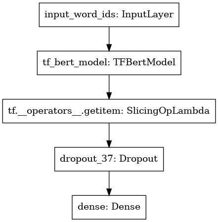

# ITP4514 Mini Project
> This repository selected 'Local News Classification for Four Types of News' as topics

Form a group of maximum 3 members. Each group should one og the following topics and implement a Solution with Python code with the relevant dataset(s). your major tasks are listed under Mark Distribution. Your deliverable will consist of the dataset(s), Python code, and a report (700-800 words) which will record the details of the process of your works.

### Prescribed Topics
1. Local News Classification for Four Types of News
2. Customer Segmentation of Online Grocery
3. Chatbot for Online bookstore
4. Recommender System for Online Games
5. Image Recognition with CNN for Six Types of Fruit
6. Sales Prediction with RNN
7. Optional Path for Taking MTR Trains
8. Course Timetabling with CSP

### Mark Distribution
1. Problem Analysis 10%
2. Data Preparation & Analysis 20%
3. Solution Design 10%
4. Solution Implementation 40%
5. Reflection & Reporting 20%

### Model Design 


### Data reference
```
@article{misra2022news,
  title={News Category Dataset},
  author={Misra, Rishabh},
  journal={arXiv preprint arXiv:2209.11429},
  year={2022}
}

@book{misra2021sculpting,
  author = {Misra, Rishabh and Grover, Jigyasa},
  year = {2021},
  month = {01},
  pages = {},
  title = {Sculpting Data for ML: The first act of Machine Learning},
  isbn = {9798585463570}
}
```
./data/News_Dataset.csv is removed 11 categories from origin dataset